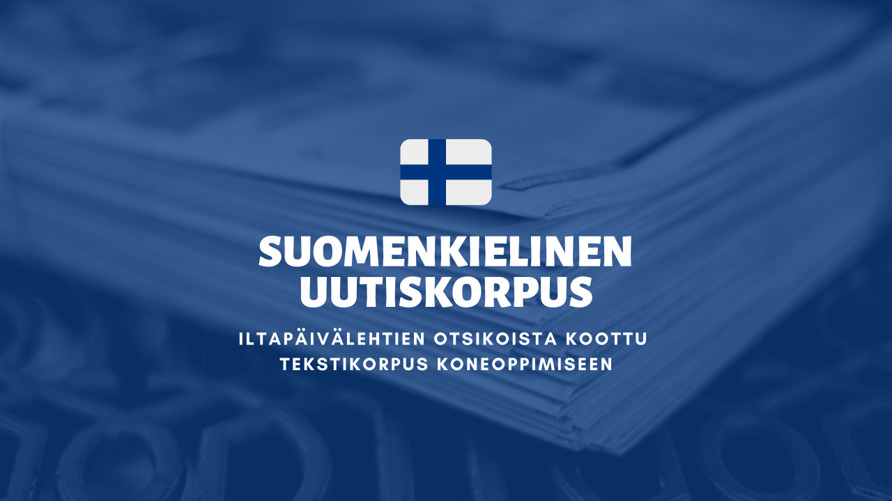
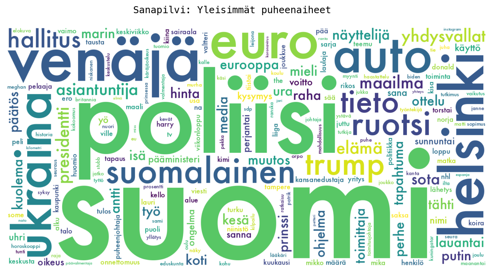
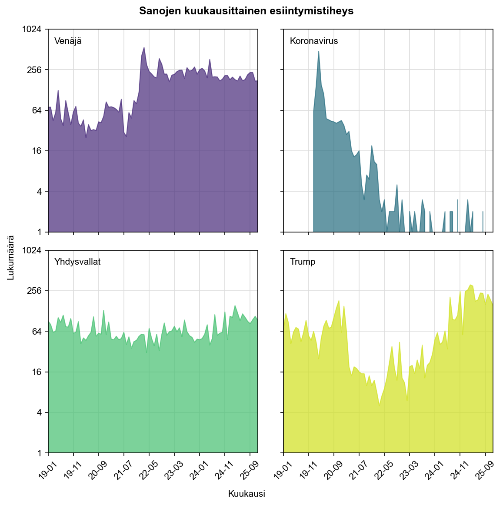

# Suomenkielinen Tekstikorpus

***Finnish Language Text Corpus***

This is a text corpus of Finnish news headlines. 
This dataset is a collection of news headlines and short summaries of text, organized by date, into CSV files. 
It is intended for language-based use cases. 
The remainder of this document will be in Finnish.

<picture>

</picture>

Tämä on iltapäivälehtien otsikoista koottu tekstikorpus. 
Tämä arkisto sisältää uutisotsikoista koottuja tekstejä CSV-tiedostoina. 
Jokaisesta uutisesta on tallennettu otsikko, lyhyt lisäteksti, kuva-linkki, sekä julkaisupäivämäärä. 
Arkisto on järjestetty kronologisesti.

## Tiedostojen kuvaus

Tämä arkisto koostuu useasta tiedostosta (shard) joista jokainen sisältä saman verran rivejä (1000). 
Nämä osat on luotu aikajärjestyksessä, eli `shard-0` sisältää vanhimmat julkaistut artikkelit, ja suurin shard numero sisältää uusimmat artikkelit. 
Jokainen CSV-tiedosto sisältää sarakeotsikot ensimmäisellä rivillä. 

| Sarake        | Kuvaus                     | Tyyppi                   | 
|:--------------|:---------------------------|:-------------------------| 
| `paivamaara`  | alkuperäinen julkaisupäivä | ISO 8601 (UTC), NOT NULL |
| `otsikko`     | uutisartikkelin otsikko    | string, NOT NULL         |
| `tiivistelma` | lisäteksti                 | string, NULL             |
| `kuva`        | artikkelin kuva (URL)      | string, NULL             |
| `id`          | uniikki tunniste           | string, NOT NULL         |

Jokaisella julkaistulla artikkelilla on uniikki tunniste, ja tiedostoja kerätessä on varmistettu että tämä korpus ei sisällä kaksoiskappaleita. 
Jos haluat enemmän tietoa artikkelista, tiedon haku on mahdollista tunnisteen avulla (tämä arkisto ei sisällä lähdekoodia lisätietojen hakua varten).

### Tilastot

<pre>
Vuosi   Määrä      Vuosi   Määrä      Vuosi   Määrä
-----   -----      -----   -----      -----   -----
2025    48416      2020    42937      2015       66
2024    44613      2019    48699      2014       17
2023    45158      2018     9142      2013        1
2022    40875      2017      249      2012       14
2021    38922      2016      157                   
</pre>

| Yhteensä              | 319266     |
|-----------------------|-----------:|
| Vanhin artikkeli      | 2012-01-01 |
| Uusin artikkeli       | 2025-12-31 |
| Tiedostojen lukumäärä | 320        |

### Ajanjaksot[^1][^2]

Tämä on kronologinen kokoelma artikkeleja. Voit rajata kokoelmaa esim. tunnisteiden perusteella.

| Vuosi | Ensimmäinen                        | Viimeinen                          |
|-------|------------------------------------|------------------------------------|
| 2025  | `6660598F65BC4334ACBFE96E94D775C9` |                                    |
| 2024  | `FFD672D52C594F0FB58FB0E295EB3EF8` | `93BF99AB2E78400EA3810B43180C8DCF` |
| 2023  | `178E3C24DEB04188AFD601E28F71115F` | `FB8143D7A2E048409E8CB61279225BD7` |
| 2022  | `F958F8B650D24923BA7B66EB968E9147` | `6C86A434AB254A3C96B577794EDE4F67` |
| 2021  | `C8695FAF6FA548A4887678FCC91275CF` | `4E9ABCA927F1473A94AA2A4A17B82F4F` |
| 2020  | `91EC5FB8EC88429588DC33EB1F0AD285` | `E4C877777DAA4F9599CF4600D5EC477A` |
| 2019  | `08B54A39B9B5438B9CB94CE548D5321F` | `DF6A0D528F5F4041BC2AEEE156937EFC` |
| 2018  | `201712282200634312`               | `0FF72F755B554FA889147BFBACAAE724` |

## Analyysejä

  

<strong>Sanapilvi: Yleisimmät puheenaiheet vuosina 2012&mdash;2025.</strong>
  
<picture>

</picture>

  

<picture>

</picture>

  

[^1]: Tämä korpus alkaa virallisesti päivämäärästä 4.11.2018. Osa artikkeleista on alun perin huomattavasti vanhempia. Vanhempia artikkeleja on muokattu alkuperäisen julkaisupäivän jälkeen, mistä syystä kyseiset artikkelit ovat ilmestyneet Iltalehden sivustolle uudestaan, ja siten päätyneet osaksi tätä korpusta. Vanhempien artikkelien kokoelma (ja vuoden 2018 ensimmäisen artikkelin tunniste) saattaa muuttua.

[^2]: Palvelin oli hetkellisesti pois päältä 11.8.-28.8.2021. Tämän ajanjakson artikkeleja on lisätty korpukseen jälkikäteen.

